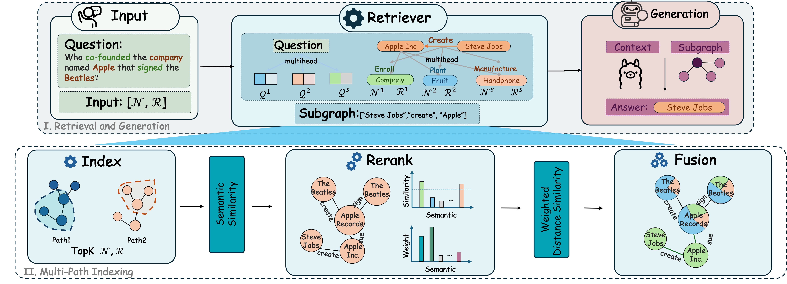

# GEAR: Graph-Efficient Augmented Retrieval

[](https://opensource.org/licenses/BSD-3-Clause)
[](https://www.python.org/downloads/release/python-390/)
[](https://arxiv.org/abs/XXXXX.XXXXX)

This repository contains the official implementation for the paper: **GEAR: Graph-Efficient Augmented Retrieval via Adaptive Knowledge-Path Fusion**.

<p align="center">

</p>

*Figure 1: The GEAR pipeline, showcasing multi-semantic indexing, retrieval, re-ranking, fusion, and generation.* 

[cite_start]GEAR is a novel framework designed to enhance Retrieval-Augmented Generation (RAG) systems that leverage knowledge graphs.  [cite_start]It addresses key challenges in existing graph-RAG pipelines, such as the "semantic gap" and "inter-module misalignment," which can lead to inefficient and inaccurate retrievals.  [cite_start]By employing a multi-head architecture, GEAR interprets queries across diverse semantic spaces, fuses knowledge paths adaptively, and constructs coherent subgraphs that are precisely aligned with user intent. 

## Framework Overview

The core of GEAR is an end-to-end pipeline that unifies retrieval, re-ranking, and subgraph construction through a multi-head architecture. This ensures semantic coherence from the initial query to the final generated answer.


## Key Features

-   [cite_start]**Multi-Head Architecture:** Deconstructs complex queries into multiple semantic facets using Transformer attention heads for more nuanced, parallel retrieval. 
-   [cite_start]**Adaptive Knowledge-Path Fusion:** Dynamically weighs and re-ranks retrieved paths based on their relevance and structural importance, intelligently merging disparate evidence into a coherent subgraph. 
-   [cite_start]**End-to-End Unified Design:** Resolves inter-module misalignment by maintaining a persistent "semantic signature" throughout the entire pipeline, from retrieval to generation. 
-   [cite_start]**Subgraph Construction Variants:** Implements and evaluates multiple strategies for subgraph construction to suit different use cases, including Fusion-Union, Fusion-PPR (Personalized PageRank), and Fusion-PCST (Prize-Collecting Steiner Tree). 

## Installation

1.  **Clone the repository:**
    ```bash
    git clone [https://github.com/gabbyzyk/GEAR.git](https://github.com/gabbyzyk/GEAR.git)
    cd GEAR
    ```

2.  **Install dependencies:**
    It is recommended to use a virtual environment (e.g., `conda` or `venv`).
    ```bash
    pip install -e .
    ```
    This will install the `gear-fusion-retriever` package in editable mode along with all dependencies listed in `pyproject.toml`.

## Quick Start

Here is a basic example of how to use GEAR to retrieve a subgraph for a given query.

```python
from gear_fusion_retriever import GEAR_Retriever
# You will need to implement your own data loaders based on your data format
from your_project.data_loader import load_graph_data, load_textual_attributes

# 1. Initialize the retriever
# This step would typically load the necessary models and configurations
retriever = GEAR_Retriever(model_name_or_path="path/to/your/language/model")

# 2. Load your graph data and textual attributes
# These functions are placeholders for your data loading logic
graph = load_graph_data("path/to/your/graph.pt")
textual_nodes, textual_edges = load_textual_attributes("path/to/your/text_data")

# 3. Define a query
query = "Who co-founded the company named Apple that signed the Beatles?"

# 4. Retrieve a subgraph using one of the fusion strategies
# The result is a list of (head, relation, tail) triplets
subgraph_triplets = retriever.retrieve(
    query=query,
    graph=graph,
    textual_nodes=textual_nodes,
    textual_edges=textual_edges,
    strategy="Fusion-Union" # Other strategies: "Fusion-PPR", "Fusion-PCST"
)

# 5. Print the result
print(f"Retrieved Subgraph for query: '{query}'")
for head, relation, tail in subgraph_triplets:
    print(f"({head}) --[{relation}]--> ({tail})")